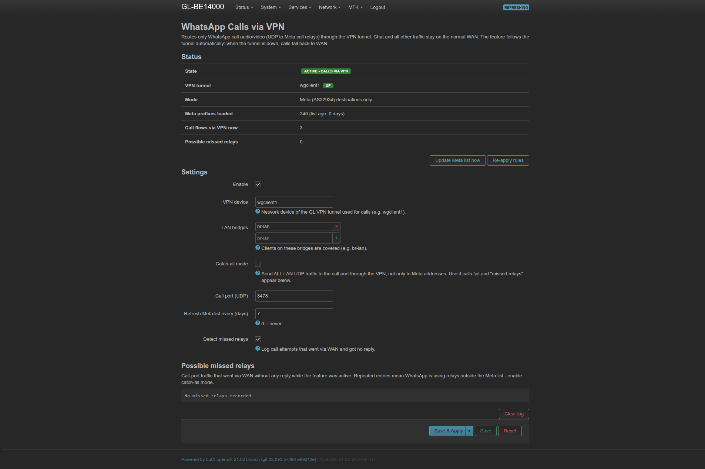

# WhatsApp Calls via VPN for OpenWrt / GL.iNet

Route **only WhatsApp voice and video calls** through a VPN tunnel on an OpenWrt router.
Chat, media, and all other traffic stay on your normal internet connection.

Built for networks where the ISP blocks WhatsApp calls: the call rings, then gets stuck on **"Connecting…"** after you answer.
It includes a LuCI page with an on/off switch and live status.



---

## Contents
- [How it works](#how-it-works)
- [Requirements](#requirements)
- [Installation](#installation)
- [Using it](#using-it)
- [Configuration](#configuration)
- [Command line](#command-line)
- [Uninstall](#uninstall)
- [FAQ](#faq)
- [Further docs](#further-docs)

---

## How it works

Packet captures on an affected network ([docs/INVESTIGATION.md](docs/INVESTIGATION.md)) showed:

| Traffic | Without VPN |
|---|---|
| WhatsApp chat / signalling (TCP 443, 5222) | ✅ works, which is why the phone rings |
| Call media to Meta relays (**UDP 3478**) | ❌ dropped by the ISP, so the call stays on "Connecting…" |

All call audio and video, including calls to people outside your network, goes through **WhatsApp relay servers on UDP port 3478**,
and those servers sit inside **Meta's own IP space (AS32934)**.

So the router needs only one targeted rule:

> UDP from LAN → port **3478** → destination in **Meta's IP ranges** ⇒ send via the **VPN**

```
LAN client ──► mangle PREROUTING [WA_CALL]
                 UDP dport 3478 && dst ∈ ipset wa_meta ⇒ fwmark 0x01000000 (saved to conntrack)
           ──► ip rule 5200: fwmark 0x01000000 → table 2001 → default dev <vpn>
           ──► nat POSTROUTING [WA_CALL_NAT]: MASQUERADE on <vpn>
Everything else ──► normal routing (WAN)
```

- **No DPI needed.** The rule matches the call's first packet, so calls connect immediately.
- **Fails open.** If the VPN goes down, the rules are removed and calls go back to WAN (and fail as before). Nothing else is affected.
- **Additive only.** The package uses its own ipset, iptables chains, fwmark bit, and routing table, and doesn't edit your firewall, VPN, or DPI configuration.
  The only change to existing config is one `firewall` include entry, so the rules come back after firewall reloads.
- **Self-maintaining.** Meta's prefix list is refreshed from RIPEstat every 7 days (240+ prefixes). A monitor flags call attempts that
  still leak to WAN without a reply ("missed relays").

Full design: [docs/ARCHITECTURE.md](docs/ARCHITECTURE.md).

---

## Requirements

| Item | Notes |
|---|---|
| OpenWrt **21.02 / 22.03** with **fw3 / iptables** | Tested on GL.iNet GL-BE14000, firmware 4.9.2 (OpenWrt 21.02). **fw4/nftables is not supported yet.** |
| Packages | `iptables`, `ipset`, `kmod-ipt-ipset`, `conntrack`, `curl`, `jsonfilter` (preinstalled on GL.iNet) |
| A working VPN client interface | WireGuard or OpenVPN, e.g. GL.iNet `wgclient1`, or `wg0` / `tun0` on plain OpenWrt |
| LuCI (optional) | For the web page. Uses the modern JS LuCI (`luci-base` ≥ 21.02) |
| IPv4 | IPv6 is not handled (the tested network had IPv6 disabled) |

Check quickly over SSH:
```sh
which iptables ipset conntrack curl jsonfilter && iptables -V && ls /usr/sbin/fw4 2>/dev/null || echo "fw3 OK"
```

---

## Installation

### 1. Prepare the VPN tunnel (GL.iNet)

The package routes calls through an existing VPN interface. It does **not** decide what else uses the VPN.
On GL.iNet, set the VPN up so it carries **nothing else**:

1. **VPN → VPN Dashboard →** add or select your WireGuard/OpenVPN profile.
2. Use **policy mode (VPN tunnels)**, not global mode. Global mode sends *all* traffic through the VPN and adds a kill switch.
3. The GL UI requires a source for the tunnel. Choose one that has no devices, for example the Guest network if you don't use it.
   To make it match nothing permanently, point it at the unused `iot` network over SSH:
   ```sh
   uci set route_policy.@rule[0].from='iot'; uci commit route_policy; /etc/init.d/vpn-client restart
   ```
   Check the rule index with `uci show route_policy | grep "=rule"`.
4. Note the VPN **device name**: `wgclient1` for the first GL WireGuard client, `ovpnclient1` for OpenVPN. List them with `ip -br link`.

On plain OpenWrt, any WireGuard/OpenVPN interface works (e.g. `wg0`). Make sure it doesn't set a default route for everything
(`route_allowed_ips 0` for WireGuard).

### 2. Install

SSH into the router:
```sh
cd /tmp
curl -fsSL https://github.com/amartinawi/openwrt-whatsapp-calls-vpn/archive/refs/heads/main.tar.gz | tar xz
sh openwrt-whatsapp-calls-vpn-main/install.sh
```

If your VPN device is not `wgclient1`:
```sh
uci set wa_call.main.vpn_if='wg0'; uci commit wa_call; /etc/init.d/wa-call reload
```

The installer:
- copies files to `/etc/wa-call/`, `/etc/init.d/wa-call`, `/etc/config/wa_call`, the hotplug hook, and the LuCI files
- adds `firewall.wa_call` (a fw3 include that re-applies rules after firewall reloads)
- enables and starts the service
- registers the files in `/lib/upgrade/keep.d/`, so they survive firmware upgrades that keep settings

An existing `/etc/config/wa_call` is kept on re-install.

### 3. Verify
```sh
/etc/wa-call/wa-call.sh status
```
```
enabled:        1
vpn (wgclient1):  up
state:          ACTIVE - calls via VPN
mode:           Meta prefixes, UDP 3478
prefixes:       240 (list age 0 days, /etc/wa-call/meta-ipv4.txt)
call flows now: 0
missed relays:  0
```
Make a WhatsApp call. `call flows now` should go above 0, and `tcpdump -ni wgclient1 udp port 3478` shows the media.

---

## Using it

### LuCI page
**LuCI → Services → WhatsApp Calls via VPN**. On GL.iNet, LuCI is at `http://192.168.8.1:8080/cgi-bin/luci`,
or use *System → Advanced Settings* in the GL UI.

| Element | What it does |
|---|---|
| **Status** (auto-refresh 5 s) | State (Active / Idle / Disabled), VPN up/down, mode, prefixes loaded, live call flows via VPN, missed relays |
| **Update Meta list now** | Downloads the current AS32934 prefix list from RIPEstat |
| **Re-apply rules** | Re-installs the rules (normally automatic) |
| **Enable** | Master on/off switch |
| **Catch-all mode** | Send *all* LAN UDP/3478 through the VPN, not only to Meta addresses |
| **Possible missed relays** | Log of call attempts that went via WAN without a reply, with a **Clear log** button |

**Save & Apply** re-applies rules in place without dropping an active call.

### Day-to-day
Turn the **VPN tunnel on or off** (GL VPN Dashboard, or `ifup`/`ifdown`). Calls follow it automatically:

| VPN tunnel | Feature | Calls go via |
|---|---|---|
| up | enabled | **VPN** ✅ |
| down | enabled | WAN (idle, rules removed) |
| any | disabled | WAN |

---

## Configuration

`/etc/config/wa_call`:

| Option | Default | Description |
|---|---|---|
| `enabled` | `1` | Master switch |
| `vpn_if` | `wgclient1` | VPN network device used for calls |
| `lan_if` (list) | `br-lan` | LAN bridges whose clients are covered (add `br-guest` etc.) |
| `port` | `3478` | UDP port used by WhatsApp call relays |
| `catch_all` | `0` | `1` = all LAN UDP to `port` via VPN, whatever the destination |
| `refresh_days` | `7` | Refresh the Meta prefix list every N days (`0` = never) |
| `prefix_url` | RIPEstat AS32934 | Source for the prefix list (RIPEstat JSON format) |
| `miss_check` | `1` | Enable the missed-relay detector |
| `miss_ignore_sport` (list) | `41641` | Source ports ignored by the detector (Tailscale) |

After editing: `uci commit wa_call && /etc/init.d/wa-call reload`.

---

## Command line

```sh
/etc/wa-call/wa-call.sh status          # human-readable status + rule counters
/etc/wa-call/wa-call.sh status --json   # machine-readable (used by LuCI)
/etc/wa-call/wa-call.sh apply           # install/remove rules based on current state
/etc/wa-call/wa-call.sh update-list     # refresh Meta prefixes now
/etc/wa-call/wa-call.sh down            # remove rules (until next apply)
/etc/init.d/wa-call {start|stop|reload|enable|disable}
logread -e wa-call                      # log (state changes, list updates, missed relays)
```

---

## Uninstall
```sh
sh /tmp/openwrt-whatsapp-calls-vpn-main/uninstall.sh
```
(or re-download the repo first). This removes every file, the firewall include, the rules, and the LuCI page. Your VPN and firewall settings are left untouched.

---

## FAQ

**Does this send all WhatsApp traffic through the VPN?**
No. Only UDP 3478 to Meta, which is call media. Chat, status, and media downloads use your normal connection.

**What if WhatsApp changes relay IPs?**
The rule matches all of Meta's announced IPv4 space, not individual relays, and the list refreshes weekly.
If calls still fail and **missed relays** appear in LuCI, enable **catch-all mode**.

**Why not use DPI (e.g. GL.iNet's built-in DPI / Netify)?**
DPI identifies a flow only after its first packets have been routed and NATed to WAN, and a NATed flow can't be moved.
The destination and port are known in advance, so a static rule is simpler and catches calls from the first packet.
See [docs/ARCHITECTURE.md](docs/ARCHITECTURE.md#why-not-dpi).

**Does signalling on WAN and media on VPN (two different public IPs) break calls?**
No. This was tested explicitly: WhatsApp relays don't require both to come from the same IP.

**Will Facebook/Instagram go through the VPN?**
Only UDP 3478 traffic to Meta does, and those apps rarely use it. Their normal traffic stays on WAN.

**Does it work on fw4 / OpenWrt 23.05+?**
Not yet. The rules use iptables/ipset. An nftables port is welcome: see [CONTRIBUTING](#contributing).

**Is this legal?**
Check your local laws and your ISP's terms. This project only changes routing on your own router. You are responsible for how you use it.

---

## Further docs
- [docs/INVESTIGATION.md](docs/INVESTIGATION.md): packet-capture findings that led to this design
- [docs/ARCHITECTURE.md](docs/ARCHITECTURE.md): rules, marks, tables, and lifecycle in detail
- [docs/TROUBLESHOOTING.md](docs/TROUBLESHOOTING.md): diagnosing problems
- [CHANGELOG.md](CHANGELOG.md)

## Contributing
Issues and pull requests are welcome, especially:
- an **fw4 / nftables** backend
- **IPv6** support
- an OpenWrt SDK `Makefile` to build a proper `.ipk`
- reports from other routers and ISPs (please include `wa-call.sh status` output, with public IPs redacted)

## License
[MIT](LICENSE). Not affiliated with WhatsApp, Meta, GL.iNet, or OpenWrt.
